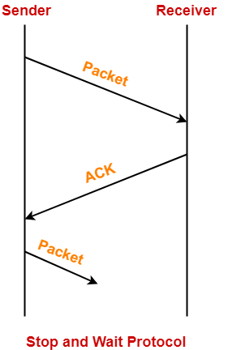

# Data Link Layer protocols simulator

Um sistema Half-Duplex, que simula uma camada de enlace implementando enquadramento por flag no inicio `STX` e fim `ETX` de quadro, o controle de fluxo utilizando `Stop-and-Wait` e detecçao de erros utilizando `CRC`.

##  | STX | MAC Sender | MAC Receiver |  Payload | ETX | CRC |

Os conceitos necessarios para entender a implementacao encontram-se abaixo: 

# Framing
ou Enquadramento

* Dividir o bit-stream em quadros (unidade de transmissao de dados) para gerenciar a transmissão e facilitar no controle de erros.

### Contagem de caracter

* Adicionar um campo no header indicando o número de caracteres presente no frame (quadro)

* Ao receber o quadro, o receiver lê o campo de contagem e sabe a partir dali determinar onde está o final do quadro

[Problema:] perde sincronização se houver erro no campo que indica o número de caracteres.

### Enquadramento por caracter [Implementado]

* Inserir um caracter especial no ínicio e no fim do quadro

[Problema] End of TeXt (`ETX`) ou Start of TeXt (`STX`) podem estar presente nos DADOS (se repetir dentro dos dados), o que gera erro de interpretação 

##### Tentativa de soluçao

* Inserir um dado `DLE` (Data Link Escape) antes de cada caracter especial

[Problema] `DLE` pode ainda estar presente nos DADOS

##### Solucao definitiva

* Percorrer o payload antes de transmitir

* Se encontrar um `DLE` inserir outro `DLE` antes deste

* Assim, quando o receptor encontrar dois DLEs ele descarta um e sabe qe o resto eh texto e nao flag

### Enquadramento por bit

* Delimitador de frame: flag (sequencia padrao de bits)

* Cada quadro começa e termina com o flag.

[Exemplo] `01111110` ou `01^60`

[Problema] O flag pode estar presente nos DADOS

* Regra: a cada sequencia de `5 bits '1'` inserir um `bit '0'` (chamado de bit stuffing) (Usado no HDLC)

# Codigos de Detecçao/Correçao de Erros

* Duas estrategias basicas:

1 - Incluir informacao redundante suficiente para permitir que o receptor detecte e corrija erros ("Open loop")

2 - Incluir informaçao redundante apenas para permitir que o receptor detecte erros na mensagem ("Feedback")

#### Open Loop

* Nao ha necessidade de retransmissao

* Receptor eh capaz de recuperar a informacao (Forward Error Correction - `FEC`)

#### Feedback

* Receptor detecta erro e solicita retransmissao ao trasmissor (implementaçao atraves dos protocolos `ARQ`) [Implementado]

## Controle de Fluxo [Implementado]

## Metodos de Detecçao de erro

* Paridade

* Paridade Combinada

* Checksum

* `CRC` [Implementado]

### Paridade

* Acrescentar um bit de paridade ao caracter

* paridade par e impar (contagem de `1's`)

* Calculada pelo hardware de conversao para serial

[Problema] um `0` virar `1` e um `1` virar `0` - bit de paridade vai estar "correto" mas ha falha

### Paridade Combinada

* Combinacao da paridade Longitudinal (`LRC` - Longitudinal Redyndancy Checking) com a paridade Vertical (`VRC` - Vertical Redundancy Checking)

* Acrescentar um bloco (`BBC` - BLock Charackter Check) que apresenta uma operaçao logica dos bits (permite correçao de erros) 

[Problema] erros quadrados ou erros duplos

### Checksum da internet
ou Soma de Verificaçao

* Em camada de transporte (ignorado)

##### Sender Checksum

* Trata conteudo dos segmentos como sequencias de numeros inteiros de `16 bits` (blocos de `16 bits`)

* adicao (em complemento de um) do conteudo do segmento

* adiciona o valor do checksum no campo checksum do UDP

##### Receiver Checksum

* Computa o checksum do segmento recebido

* Verifica se o checksum calculado eh = ao valor do campo checksum:
  * NAO - erro detectado
  * SIM - nao detectou erro

### CRC [Implementado] 
ou Código de Redundância Ciclica 

* Cadeias de bits representadas por polinomios de coeficientes `0` e `1` apenas

* Utiliza um polinomio gerador, que é conhecido por ambos os lados (receiver e sender)

* Funciona da seguinte forma: Um código `CRC` é incorporado a mensagem enviada, o receptor quando a recebe, faz o cálculo e verifica se o CRC resultante é o mesmo incorporado a mensagem.

* O cálculo é feito com base na divisão da mensagem binária pelo gerador, os valores são calculados separadamente com um `XOR`.

* Calcula a divisao

* Subtrai o resto do numero original

[EXEMPLO] codigo Polinomial: 
` * x^3 + 1 (chave 1001)`
  
  `* x^2 + x (chave 110)`
  
  `* x^5 + x^3 + x^2 + x^0 (chave 101101)`

##### Sender CRC [Implementado]

* Converte a string que deseja enviar para binario

* Concatena o numero de zeros a string, correspondente ao grau do polinomio - 1

* Calcula o `CRC` //modulo 2 - xor que é realizado transladando para a direita a cada iteração

* O resto da divisao é o `CRC`

* Adiciona ao final da mensagem o codigo `CRC`

* O sender envia os `dados+CRC` para o receiver

##### Receiver CRC [Implementado]
* O receiver recebe uma mensagem codificada do sender

* O receiver (com sua replica da chave) decodifica os dados e verifica o resto da divisao

  * se o resto for `0s`, entao não houve erro, um `ACK` e enviado ao sender

  * se o resto for `!0s`, deu algum erro, e um `NON ACK` é enviado ao sender

* O sender precisa reenviar o dado ate que o receiver tenha os dados corretos
